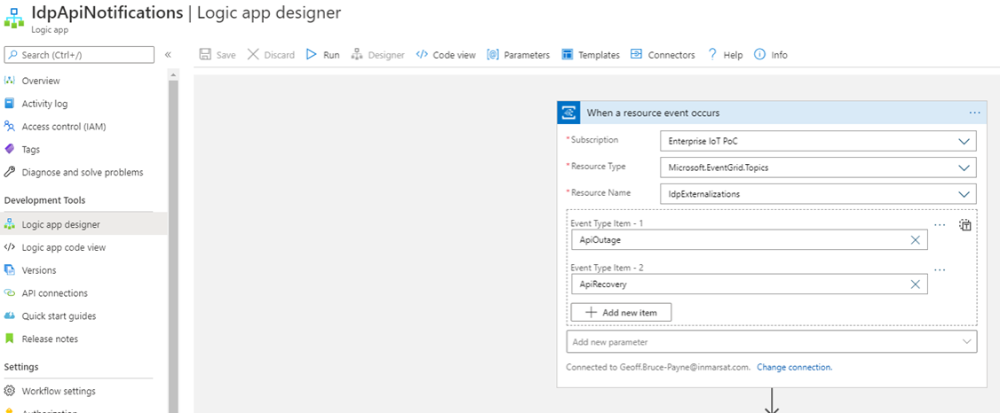

### Connect Event Grid to Logic App

**Please note** that you should have created the [Event Grid Topic](#create-the-event-grid-topic) before you can proceed with this step.

1.  Type **Logic Apps** into the Search box at the top of the `All Services` page, then select **Logic Apps**  section.

2.  Click the **Add** button to create a new Logic App.

3.  Complete the logic app creation form with the following:

    1. **Subscription**: Select your Azure subscription.
    2. **Resource group**: Select your existing Resource Group.
    3. **Logic App name**: Enter a unique value for the logic app i.e. `IdpApiNotifications`.
    4. **Location**: Select a region closest to you. Make sure you select the same region for the rest of your resources.
    5. **Log Analytics**: (Optional) Turn on Log Analytics and reference your existing workspace/project.

    

4. Once the resource is created, navigate to it and select `Blank Logic App`. In the `Search connectors and triggers`, type `Event Grid` and select the `Azure Event Grid` trigger, then `When a resource event occurs`.

5. In the dialog for `When a resource event occurs` complete the form:

    1. **Subscription**: Select your Azure subscription.
    2. **Resource Type**: Select `Microsoft.EventGrid.Topics`.
    3. **Resource Name**: Select the Event Grid Topic you provisioned i.e. `IdpExternalizations`.
    4. **Event Type Item - 1**: Enter `ApiOutage` and use it as a custom value.
    5. **Event Type Item - 2**: Enter `ApiRecovery` and use it as a custom value.

    

6. Then click on the `New Step` and type in the `Choose an action` search box `SendGrid` and click the SendGrid icon:

    1. Select `Send Email (v4)`.
    2. You may need to setup a [SendGrid account](https://sendgrid.com/) if you have not done so already. Alternatively you can choose Office 365 Email email sender or Gmail sender or whatever Logic App supports.

7. Fill out the Send email (V4) form:
    1. **From**: The email address you wish this notification be sent from
    2. **To**: The email address(es) you wish this notification be sent to
    3. **Subject**: Enter a subject e.g. `IsatData Pro: `. You can include the event type by adding Dynamic Content i.e. `Event Type`
    4. **Body**: If you select this field, you can type whatever static content you want and/or pick from one the dynamic fields shown. Search for `data` in Dynamic content and select `Data object`.

    

8. Click `Save`.